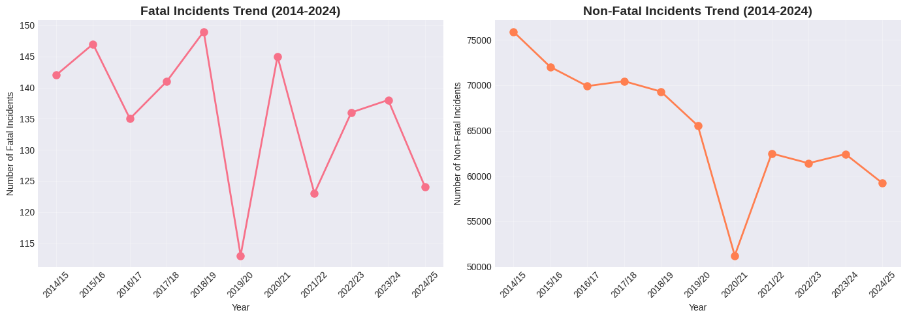
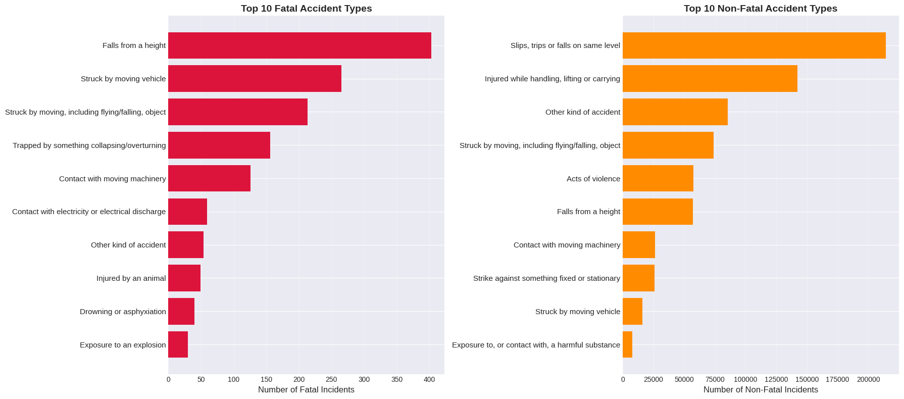
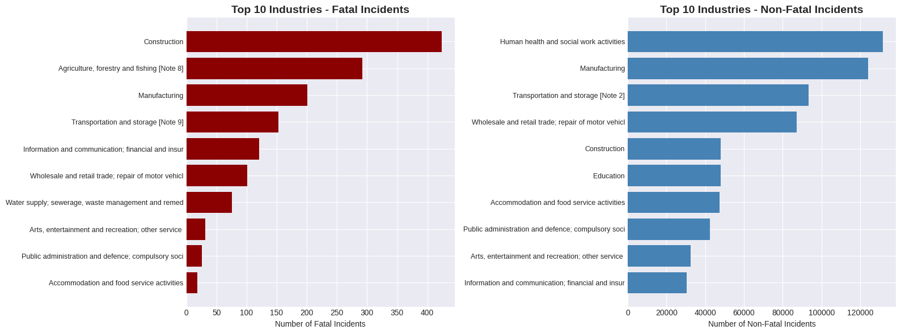

Safety Incident Analysis: UK Workplace Hazards (2014-2024)

[](https://www.python.org/downloads/)
[](LICENSE)
[](https://www.hse.gov.uk/statistics/)

A comprehensive data science project analyzing 11 years of workplace safety incidents in the UK, with special focus on the construction industry. This project combines exploratory data analysis, statistical testing, and machine learning to identify hazard patterns and predict incident severity.

---

## Table of Contents
- [Project Overview](#project-overview)
- [Key Findings](#key-findings)
- [Dataset](#dataset)
- [Project Structure](#project-structure)
- [Installation](#installation)
- [Usage](#usage)
- [Methodology](#methodology)
- [Results](#results)
- [Visualizations](#visualizations)
- [Future Work](#future-work)
- [Contributing](#contributing)
- [License](#license)

---

##  Project Overview

This project analyzes **HSE RIDDOR (Reporting of Injuries, Diseases and Dangerous Occurrences Regulations)** data from 2014-2024 to:

- Identify the most dangerous industries and accident types
- Analyze temporal trends and COVID-19 impact
- Build predictive models for incident severity classification
- Provide actionable insights for construction safety improvements

**Why Construction?** Construction consistently ranks as the most hazardous industry for fatal incidents, accounting for significant workplace deaths from falls, vehicle strikes, and structural collapses.

---

##  Key Findings

### 1. Construction Industry Hazards
- **216 deaths** from falls from height (2014-2024)
- **73 deaths** from vehicle strikes in agriculture
- **57 deaths** from collapses in construction
- Construction, Agriculture, and Transportation are the top 3 deadliest industries

### 2. COVID-19 Impact (2020/21)
- **27.4% drop** in non-fatal incidents
- Fatal incidents remained steady (construction continued as essential work)
- Post-COVID recovery to ~61,000 incidents/year

### 3. Statistical Insights
- **Chi-square test** (p < 0.000001): Industries have significantly different accident profiles
- Agriculture: machinery and drowning hazards
- Construction: height-related and structural hazards
- Education: primarily violence-related incidents

### 4. Machine Learning Performance
- **Random Forest Model**: 72.4% accuracy
- **Fatal Incident Detection**: 90% recall (critical for prevention)
- **Top Predictive Features**: 
  1. Incident count (53.4%)
  2. Accident type (16.8%)
  3. Industry sector (14.2%)

---

##  Dataset

**Source**: [HSE Statistics - RIDDOR](https://www.hse.gov.uk/statistics/tables/index.htm)

**Files Used**:
- `RIDKIND.xlsx` - Fatal and non-fatal injuries by accident type and industry

**Time Period**: 2014/15 to 2024/25 (11 years)

**Records**: 4,854 incident combinations after cleaning

**Features**:
- Year
- Industry sector (14 categories)
- Accident type (16 categories)
- Severity: Fatal, Major (specified injuries), Minor (over-7-day injuries)
- Worker type (employees vs self-employed)

---

##  Project Structure

```
safety-incident-analysis/
├── data/
│   ├── fatal_incidents_cleaned.csv
│   └── nonfatal_incidents_cleaned.csv
├── notebooks/
│   └── safety_analysis.ipynb
├── models/
│   └── random_forest_model.pkl
├── visualizations/
│   ├── trends_over_time.png
│   ├── top_accident_types.png
│   ├── industry_distribution.png
│   └── confusion_matrix.png
├── results/
│   ├── feature_importance.csv
│   ├── model_predictions.csv
│   └── EXECUTIVE_SUMMARY.md
├── README.md
└── requirements.txt
```

---

##  Installation

### Prerequisites
- Python 3.8+
- Google Colab (recommended) or Jupyter Notebook

### Setup

1. **Clone the repository**:
```bash
git clone https://github.com/yourusername/safety-incident-analysis.git
cd safety-incident-analysis
```

2. **Install dependencies**:
```bash
pip install -r requirements.txt
```

3. **Download the data**:
   - Visit [HSE Statistics](https://www.hse.gov.uk/statistics/tables/index.htm)
   - Download `RIDKIND.xlsx`
   - Place in `data/` folder

---

##  Usage

### Running the Analysis

**Option 1: Google Colab (Recommended)**
1. Upload the notebook to Google Colab
2. Upload data files to Google Drive
3. Run all cells sequentially

**Option 2: Local Jupyter**
```bash
jupyter notebook notebooks/safety_analysis.ipynb
```

### Using the Trained Model

```python
import pickle
import pandas as pd

# Load the model
with open('models/random_forest_model.pkl', 'rb') as f:
    model = pickle.load(f)

# Prepare new data (same feature format)
new_data = pd.DataFrame({
    'Year_Start': [2024],
    'Industry_Encoded': [3],  # Construction
    'Accident_Encoded': [7],  # Falls from height
    'High_Risk_Accident': [1],
    'High_Risk_Industry': [1],
    'Incident_Count': [5]
})

# Predict severity
prediction = model.predict(new_data)
print(f"Predicted Severity: {prediction[0]}")
```

---

##  Methodology

### Phase 1: Data Acquisition & Cleaning
- Loaded HSE RIDDOR data from Excel files
- Removed aggregate rows and metadata
- Standardized categorical variables
- Created clean datasets (2,464 rows each)

### Phase 2: Exploratory Data Analysis
Created 7 key visualizations:
1. Fatal/non-fatal trends over time
2. Top 10 accident types (bar charts)
3. Industry distribution
4. Severity breakdown (pie charts)
5. Heatmap: Accident type × Industry
6. Accident trends (line chart)
7. Model performance (confusion matrix)

### Phase 3: Statistical Analysis
- **Chi-square test**: Tested industry-accident association
- **Temporal analysis**: Year-over-year changes, COVID impact
- **Cross-tabulations**: Industry vs accident type patterns
- **Risk comparison**: Self-employed vs employees

### Phase 4: Feature Engineering
- Extracted year features
- Created binary risk indicators (high-risk accident/industry)
- Label-encoded categorical variables
- Handled class imbalance (3.6:1 ratio)

### Phase 5: Machine Learning
**Models Tested**:
1. Logistic Regression (baseline): 46.7% accuracy
2. Random Forest (best): 72.4% accuracy

**Evaluation Metrics**:
- Accuracy, F1-score (weighted)
- Confusion matrix
- Class-specific precision/recall
- Feature importance analysis

---

##  Results

### Model Performance Summary

| Model | Accuracy | F1-Score | Fatal Recall | Major Recall | Minor Recall |
|-------|----------|----------|--------------|--------------|--------------|
| Logistic Regression | 46.7% | 0.467 | 86% | 43% | 40% |
| **Random Forest** | **72.4%** | **0.723** | **90%** | **71%** | **69%** |

### Feature Importance

| Rank | Feature | Importance |
|------|---------|------------|
| 1 | Incident Count | 53.4% |
| 2 | Accident Type | 16.8% |
| 3 | Industry Sector | 14.2% |
| 4 | Year | 7.7% |
| 5 | High-Risk Industry | 4.2% |
| 6 | High-Risk Accident | 3.8% |

### Confusion Matrix Insights
- **Fatal Detection**: 90% recall (110/122 correctly identified)
- **Major Injuries**: 71% recall (moderate performance)
- **Minor Injuries**: 69% recall (moderate performance)

The model excels at identifying fatal incidents, which is the most critical use case for prevention.

---

##  Visualizations

### 1. Trends Over Time

*Fatal incidents show volatility; non-fatal incidents dropped 27% during COVID-19*

### 2. Top Accident Types

*Falls from height dominate fatal incidents; slips/trips lead non-fatal*

### 3. Industry Distribution

*Construction leads in both fatal and non-fatal incidents*

### 4. Confusion Matrix

*Random Forest achieves 72.4% accuracy with strong fatal detection*

---

##  Future Work

### Data Enhancements
- [ ] Add weather data (temperature, precipitation, wind)
- [ ] Include time-of-day and day-of-week features
- [ ] Incorporate worker demographics (age, experience)
- [ ] Add equipment age and maintenance records
- [ ] Regional analysis (county-level data)

### Model Improvements
- [ ] Hyperparameter tuning (GridSearchCV)
- [ ] Ensemble methods (XGBoost, LightGBM)
- [ ] Deep learning models (Neural Networks)
- [ ] SMOTE for better class balance handling
- [ ] Time-series forecasting for incident prediction

### Deployment
- [ ] Build interactive dashboard (Streamlit/Dash)
- [ ] Create REST API for real-time predictions
- [ ] Deploy model to cloud (AWS/GCP)
- [ ] Integrate with safety management systems

### Additional Analysis
- [ ] Causal inference (why accidents happen)
- [ ] Cost-benefit analysis of interventions
- [ ] Network analysis (related incidents)
- [ ] Text analysis of incident descriptions

---

##  Contributing

Contributions are welcome! Please follow these steps:

1. Fork the repository
2. Create a feature branch (`git checkout -b feature/AmazingFeature`)
3. Commit your changes (`git commit -m 'Add AmazingFeature'`)
4. Push to the branch (`git push origin feature/AmazingFeature`)
5. Open a Pull Request

**Areas for Contribution**:
- Additional visualizations
- Model improvements
- Data pipeline automation
- Documentation enhancements

---

## 📄 License

This project is licensed under the MIT License - see the [LICENSE](LICENSE) file for details.

---

##  Acknowledgments

- **Health and Safety Executive (HSE)** for providing open data
- **UK Government** for RIDDOR reporting framework
- **scikit-learn** and **pandas** communities for excellent libraries
- Construction industry safety professionals for inspiration

---

##  Contact

**Gobu C Babu**  
 Email: gobucbabu@gmail.com  
 LinkedIn: [your-profile](https://www.linkedin.com/in/gobu-c-babu-253609264/)  
 GitHub: [@gobucbabu](https://github.com/gobucbabu)

---

##  References

1. HSE Statistics: https://www.hse.gov.uk/statistics/
2. RIDDOR Regulations: https://www.hse.gov.uk/riddor/
3. Construction Safety Guidelines: https://www.hse.gov.uk/construction/

---


*Last Updated: December 15 2024*
